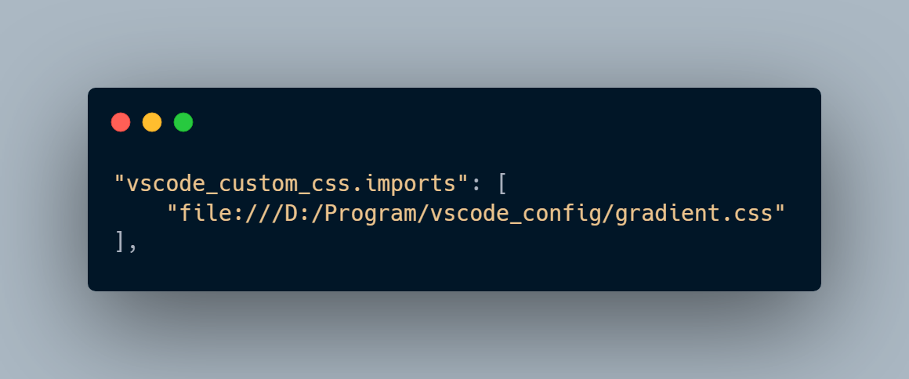
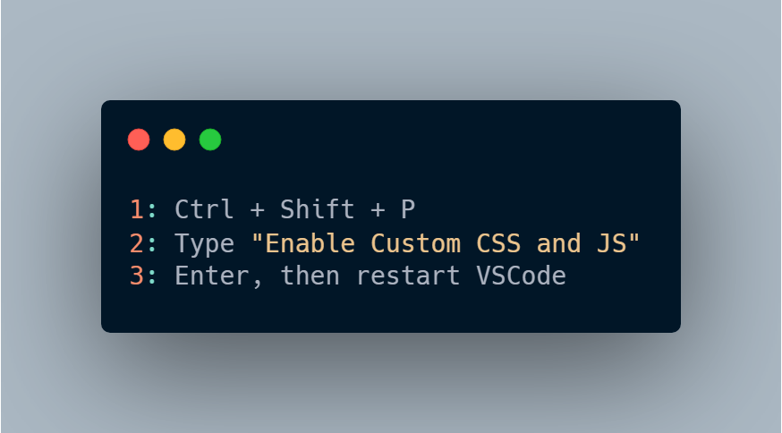
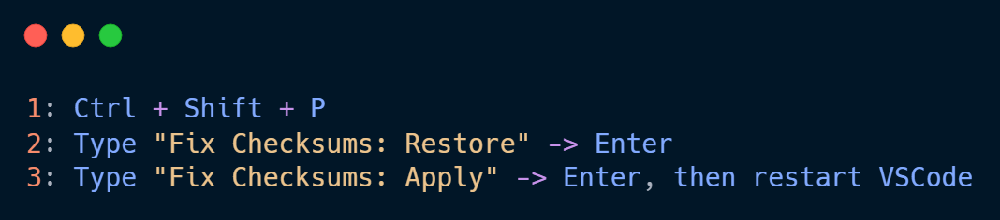

# VSCode-Config

## About

### My Theme setting is based on [**Evondev gradient.css**](https://github.com/evondev/evondev-dracula/blob/master/gradient.css) and [**my gradient.css here**](assets/css/gradient.css)

---

## Setting Theme Steps

### Step 1: Install needed extensions

-   [**Custom CSS and JS Loader**](https://marketplace.visualstudio.com/items?itemName=be5invis.vscode-custom-css)
-   [**Evondev Dracula**](https://marketplace.visualstudio.com/items?itemName=evondev.dracula-high-contrast)
-   [**Fix VSCode Checksums**](https://marketplace.visualstudio.com/items?itemName=lehni.vscode-fix-checksums)

### Step 2: Add the file path of "gradient.css" to "settings.json"

#### Open "settings.json" and add the file path of "gradient.css" like this:

<!--  -->

```json
"vscode_custom_css.imports": ["file:///D:/vscode/gradient.css"],
```

### Step 3: Apply the "gradient.css" to VSCode and fix "Unsupported"

#### Run "Custom CSS and JS Loader" extension



#### Run "Fix VSCode Checksums" extension



### Step 4: Done! Open your code and enjoy!!!

## Extensions for Web Dev:

### Snippet

-   [**Evondev Snippets**](https://marketplace.visualstudio.com/items?itemName=evondev.evondev-snippets)
-   [**JavaScript Snippet Pack**](https://marketplace.visualstudio.com/items?itemName=akamud.vscode-javascript-snippet-pack)

### Live

-   [**Live SASS Compiler**](https://marketplace.visualstudio.com/items?itemName=ritwickdey.live-sass)

### Auto

-   [**CSS Peek**](https://marketplace.visualstudio.com/items?itemName=pranaygp.vscode-css-peek)
-   [**Auto Rename Tag**](https://marketplace.visualstudio.com/items?itemName=formulahendry.auto-rename-tag)
-   [**Visual Studio IntelliCode**](https://marketplace.visualstudio.com/items?itemName=VisualStudioExptTeam.vscodeintellicode)
-   [**HTML to CSS autocompletion**](https://marketplace.visualstudio.com/items?itemName=solnurkarim.html-to-css-autocompletion)

### Theme

-   [**Evondev Dracula**](https://marketplace.visualstudio.com/items?itemName=evondev.dracula-high-contrast)
-   [**Material Icon Theme**](https://marketplace.visualstudio.com/items?itemName=PKief.material-icon-theme)

### Others

-   [**Prettier**](https://marketplace.visualstudio.com/items?itemName=esbenp.prettier-vscode)
-   [**Sublime Text Keymap**](https://marketplace.visualstudio.com/items?itemName=ms-vscode.sublime-keybindings)

-   ZSH Terminal ([**More info**](https://amitgujar15.medium.com/customize-your-git-bash-like-this-d969c68abfdb))
    1.  Install [**Git**](https://git-scm.com/downloads)
    2.  Extract [**this zip**](./assets/zstd-v1.5.2-win64.zip)
    3.  Extract "zsh.pkg.tar" inside the Git Installation Directory
    4.  Use "Git Bash" to install oh-my-zsh:
        ```
        sh -c "$(curl -fsSL https://raw.github.com/ohmyzsh/ohmyzsh/master/tools/install.sh)"
        ```
    5.  Copy .zshrc content from [**here**](./assets/.zshrc)
    6.  Enjoy ZSH!!!
